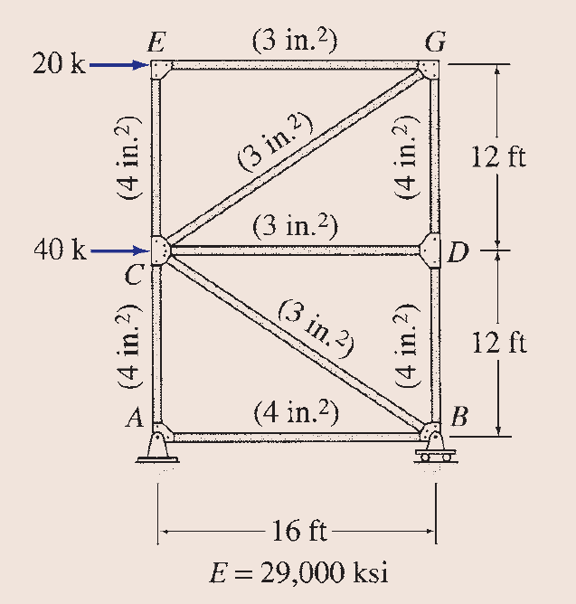
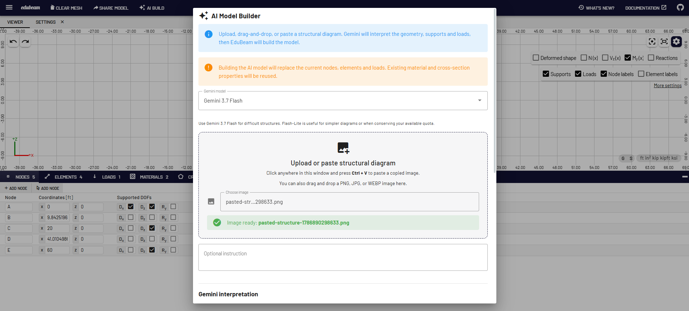
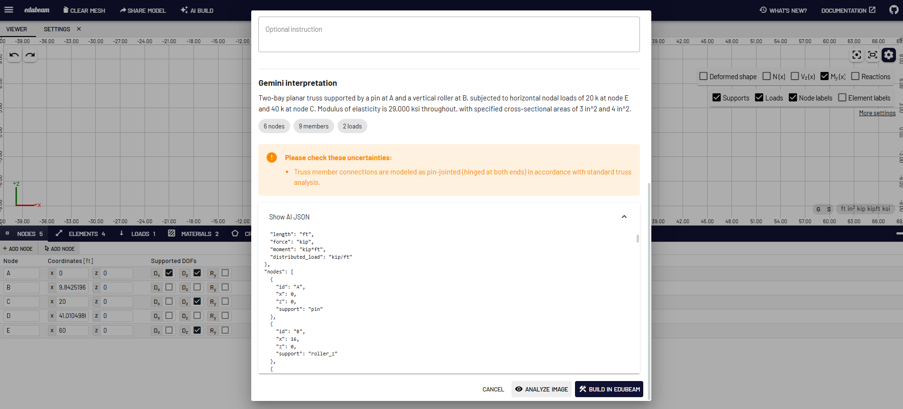
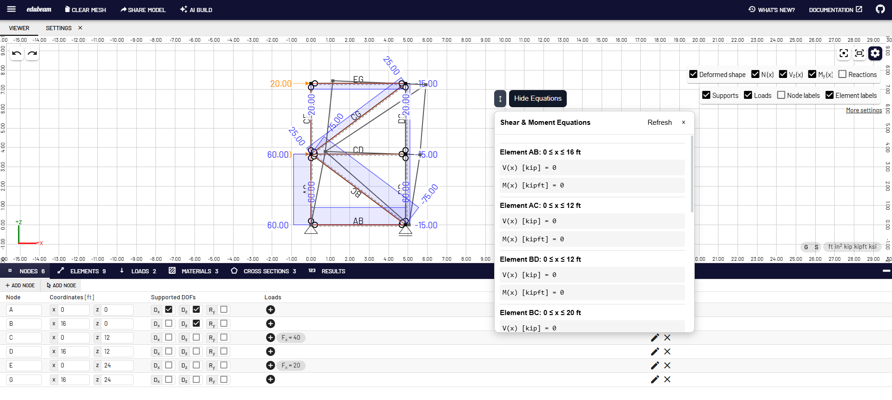

# EduBeam AI

EduBeam AI is an AI-enhanced structural-analysis and education platform based on the open-source EduBeam project.

> **Project relationship:** This repository is an unofficial modified fork of EduBeam by Jan Voříšek and contributors. The original project is available at https://github.com/janvorisek/edubeam.

## Major Additions

This fork adds:

- Gemini-powered AI Model Builder
- Structural diagram image upload
- Drag-and-drop image input
- Clipboard image paste with Ctrl+V
- Selectable Gemini models
- Automatic recognition of nodes and members
- Automatic recognition of supports and internal hinges
- Automatic recognition of nodal loads
- Automatic recognition of member point loads
- Automatic recognition of distributed loads
- Automatic recognition of structural dimensions
- Automatic SI and U.S. customary unit recognition
- Automatic display-unit selection
- Engineering coordinate convention with +z upward
- kip and ksi support
- Correct force-per-length conversion
- Member-specific Young's modulus E
- Member-specific shear modulus G
- Member-specific cross-sectional area A
- Member-specific moment of inertia I
- Cross-section height h support
- Thermal expansion coefficient alpha support
- Temperature-load recognition
- Celsius and Fahrenheit temperature-change handling
- Shear-force equation display
- Bending-moment equation display

## Important: Verify AI-Generated Models

The AI Model Builder assists with structural model creation but does not replace engineering verification.

Before solving an AI-generated model, verify:

- geometry
- dimensions
- member connectivity
- support conditions
- internal hinges and releases
- load magnitudes
- load directions
- load locations
- units
- E, G, A, and I
- cross-section properties
- thermal loads
- coefficient of thermal expansion

A finite-element model can solve successfully even when the source structural diagram was interpreted incorrectly.


## Example Workflow

The AI Model Builder can interpret a structural-analysis problem from an image, review the extracted structural information, and construct the corresponding model in EduBeam AI.

### 1. Original Structural Problem



### 2. Upload or Paste the Problem into AI Build

Users can upload, drag-and-drop, or paste a structural diagram directly into the AI Model Builder.



### 3. Review the Gemini Interpretation

Before building the model, EduBeam AI displays the interpreted structure, units, loads, supports, properties, and any uncertainties for review.



### 4. Build, Solve, and Review Structural Equations

The interpreted model is constructed in EduBeam, where users can solve the structure and inspect analysis results. The Show Equations tool can also display member-level shear-force and bending-moment equations.




# Installation

## Requirements

Install:

- Git
- Node.js 20 or newer
- npm
- A Gemini API key if you want to use the AI Model Builder

## 1. Clone the Repository

```bash
git clone https://github.com/furkan-luleci/edubeam-ai.git
cd edubeam-ai